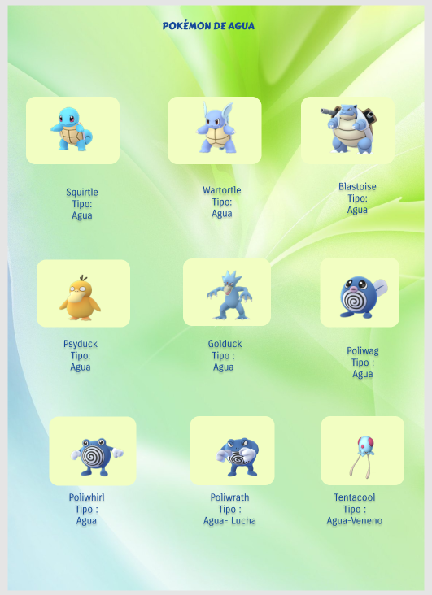

# Data Lovers

## Preámbulo

Dos años después, la emoción del juego Pokemon Go sigue con más poder en los aficionado que en cualquier otro momento desde el lanzamiento del juego del verano 2016. El cazador como se le llama al usuario en el juego,  busca, captura y  en entrena a los pokémones escondidos en el mundo real, para luchar por el control de "gimnasios" virtuales desplegados en lugares del mundo real que aparecen en los mapas de los smartphones. En este juego los creadores consideraron meter a solo 151 pokemones originales porque habría sido muy intrincado para atraer a nuevos fans meter a los  726 que hay en total.

En total hay 18 tipos de pokémon, cada tipo generalmente corresponde a un hábitat específica, de manera que los pokémons de tipo agua está precisamente en un hábitat con agua.
Un buen cazador cazador debe conocer bien  el tipo de sus pokémones para calcular cual es más fuerte o débil frente a otro en una batalla. No obstante puede ser un poco confuso para los novatos por la gran cantidad de pokemones.

## Entrevista
Comenzamos con una entrevista  a los usuarios de Pokemon Go para obtener la información sobre sus necesidades a la hora de Jugar Pokemon Go y nos ayudó  a  representar todo lo que el usuario necesitará|| ver o hacer en nuestro producto en las historias de usuarios. Formulamos las siguientes preguntas para llegar a dicha información:

* **Preséntate: genera confianza.**
Hola soy Micaela/Ivana, ¿cómo estás?
¿De dónde eres?, ¿cómo fue tu día hoy?
Este periodo de tiempo, lo que quiero es que conversemos acerca de qué necesitarías para ser mejor entrenador Pokémon.

* **Busca historias.**
	¿Me puedes platicar cuál es tu manera de elegir un Pokemon?
¿Qué necesitarías ver o saber exactamente de los Pokemones? ¿por qué?

* **Hablen sobre sentimientos.**
	¿Cuéntame sobre tu última experiencia que jugaste Pokemon Go? ¿fue buena, mala? ¿por qué dices eso?

* **Preguntas más específicas para profundizar más sobre las necesidades del usuario en el juego de Pokemon.**

En este periodo de tiempo lo que quiero es que platiquemos acerca de  qué información necesitarías para ser mejor jugador Pokémon.

1. ¿Cuáles son tus maneras de elegir un pokemon?
Conocer su nivel, tipo de ataque y si pueden evolucionar.
2. ¿Qué necesitarías ver o saber exactamente sobre un pokemon?
Saber qué tipo es, si de agua o fuego por ejemplo.
Si todavía puede evolucionar.
Si un huevo va explotar.
La cantidad de caramelos para que evolucione.
Si determinado pokémon contrarresta a otros en el gimnasio.

## Historias de usuario

**Yo como**: usuario de la página web.

**Quiero**: ver número, nombre, imagen, tipo, y probabilidad que aparezca.

**Funcionalidad**: para tener una vista rápida de la información disponible de los pokemones.

**Yo como**: usuario de la página web.

**Quiero**: filtrar por tipo a los Pokémon.

**Funcionalidad**: para identificarlo, conocerlo y para saber si un Pokémon es de más de 1 tipo.

**Yo como**: usuario de la página web.

**Quiero**: ordenar  Pokémon por nombre ascendente y descendentemente.

**Funcionalidad**: para conocerlos y me ayuda a aprender los nombres.

**Yo como**: usuario de la página web.

**Quiero**: ver el Pokémon que tiene la mayor y menor cantidad de caramelos.

**Funcionalidad**: para conocer cuántos caramelos necesita para evolucionar.

##Diseño de la Interfaz de Usuario

### Prototipo de baja fidelidad

Luego de las entrevista  realizamos un sketch o boceto de lo que sería el producto teniendo en cuenta la necesidad principal del usuario que era conocer todos los tipos de pokemons y saber si un pokémon tiene más de un tipo.

Teniendo los sketchs ya mencionados, creímos conveniente realizar una **segunda entrevista** para mejorar el prototipo
Para mejorar el prototipo de baja fidelidad pasamos a realizar una prueba de testeo y detectamos los siguientes problemas:

* Los usuarios quieren ver primero toda la lista de pokémons sin ningún filtro.
* Un cálculo sobre que pokemones necesitan más o menos caramelos para evolucionar y se filtre justo en el mismo botón donde se filtra por Asc. A-Z.

### Prototipo de alta fidelidad

Diseñamos un prototipo con la Herramienta [_Figma_](https://www.figma.com/)

 

<!--[_Prototipado_](https://www.figma.com/file/HRmNQ7QJr3ue69S16rv3IO1I/Pokemones?node-id=0%3A1)

<!--
En este proyecto deberás trabajar colaborativamente. Para ello, una de las
integrantes del equipo deberá forkear el repositorio del cohort y la otra
integrante **deberá hacer un fork del repositorio de su compañera**. Luego de
esto, deberás
[configurar](https://help.github.com/articles/configuring-a-remote-for-a-fork/)
un `remote` hacia el repositorio del cual hiciste el fork.

Para mandar cambios desde un repositorio forkeado al original debes crear un
[pull request](https://goo.gl/4bYnuh)
y el propietario del repositorio original recibirá una notificación para
[revisar el pull request](https://goo.gl/XSFcT5)
y [aceptar los cambios](https://goo.gl/HLJtqN).

Aquí algunas recomendaciones para que organices mejor el trabajo con tu
compañera:

* En lugar de trabajar en una sola rama o _branch_, puedes organizar el flujo de
  trabajo con dos ramas principales:
  - `master`: rama que contiene las funcionalidades terminadas y sin errores.
  - `develop`: rama dónde integrarás las funcionalidades conforme las vayas
    desarrollando.

* Además de tener las dos ramas anteriores, puedes trabajar cada nueva
  funcionalidad en una rama individual (_feature branches_), estas ramas en
  lugar de crearse a partir de `master`, tienen a `develop` como su rama de
  origen. Cuando una funcionalidad es terminada se integra de nuevo a `develop`.
  Las _feature branches_ no se deben integrar directamente a `master`.

* Por último, te sugerimos codear usando la técnica de
  [pair programming](https://goo.gl/uAMBX2).

¿Quieres saber más forks y pull requests?

* Un [fork](https://help.github.com/articles/fork-a-repo/) es una copia de un
  repositorio en el que puedes experimentar sin afectar al repositorio original.
  Generalmente se usa para proponer cambios al proyecto de alguien más o para
  usar el proyecto de otra persona como punto de partida para una idea que
  quieras realizar.

* Un [pull request](https://help.github.com/articles/about-pull-requests/) (PR)
  te permite solicitar la inclusión de cambios al repositorio original (tu punto
  de partida) en GitHub. Cuando un PR es abierto, este permite solicitar,
  discutir y revisar los cambios realizados con todos los colaboradores y
  agregar otros commits antes de que los cambios sean incluidos al repositorio
  original.

***

## Contenido de referencia

### Diseño de experiencia de usuario (User Experience Design)

* Investigación con usuarios / entrevistas
* Principios de diseño visual

### Desarrollo Front-end

* Unidad de testing en curso de JavaScript en LMS.
* Unidad de arreglos en curso de JavaScript en LMS.
* Unidad de objetos en curso de JavaScript en LMS.
* Unidad de funciones en curso de JavaScript en LMS.
* Unidad de DOM en curso de Browser JavaScript en LMS.
* [Array en MDN](https://developer.mozilla.org/es/docs/Web/JavaScript/Referencia/Objetos_globales/Array)
* [Array.sort en MDN](https://developer.mozilla.org/es/docs/Web/JavaScript/Referencia/Objetos_globales/Array/sort)
* [Array.map en MDN](https://developer.mozilla.org/es/docs/Web/JavaScript/Referencia/Objetos_globales/Array/map)
* [Array.filter en MDN](https://developer.mozilla.org/es/docs/Web/JavaScript/Referencia/Objetos_globales/Array/filter)
* [Array.reduce en MDN](https://developer.mozilla.org/es/docs/Web/JavaScript/Referencia/Objetos_globales/Array/reduce)
* [Array.forEach en MDN](https://developer.mozilla.org/es/docs/Web/JavaScript/Referencia/Objetos_globales/Array/forEach)
* [Object.keys en MDN](https://developer.mozilla.org/es/docs/Web/JavaScript/Referencia/Objetos_globales/Object/keys)
* [Object.entries en MDN](https://developer.mozilla.org/es/docs/Web/JavaScript/Referencia/Objetos_globales/Object/entries)
* [Fetch API en MDN](https://developer.mozilla.org/en-US/docs/Web/API/Fetch_API)
* [json.org](https://json.org/json-es.html)

### Herramientas

* [Git](https://git-scm.com/)
* [GitHub](https://github.com/)
* [GitHub Pages](https://pages.github.com/)
* [Node.js](https://nodejs.org/)
* [Jest](https://jestjs.io/)

***

## Checklist

* [ ] Usa VanillaJS.
* [ ] No hace uso de `this`.
* [ ] Pasa linter (`npm pretest`)
* [ ] Pasa tests (`npm test`)
* [ ] Pruebas unitarias cubren un mínimo del 70% de statements, functions y
  lines y branches.
* [ ] Incluye _Definición del producto_ clara e informativa en `README.md`.
* [ ] Incluye historias de usuario en `README.md`.
* [ ] Incluye _sketch_ de la solución (prototipo de baja fidelidad) en
  `README.md`.
* [ ] Incluye _Diseño de la Interfaz de Usuario_ (prototipo de alta fidelidad)
  en `README.md`.
* [ ] Incluye link a Zeplin en `README.md`.
* [ ] Incluye el listado de problemas que detectaste a través de tests de
  usabilidad en el `README.md`.
* [ ] UI: Muestra lista y/o tabla con datos y/o indicadores.
* [ ] UI: Permite ordenar data por uno o más campos (asc y desc).
* [ ] UI: Permite filtrar data en base a una condición.

-->
